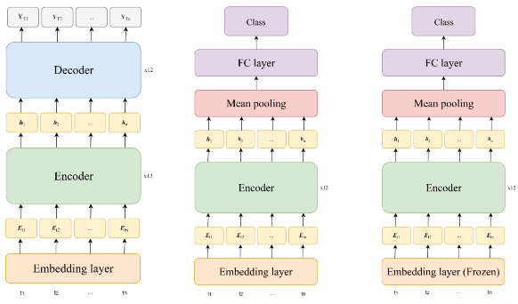

<h1>Klasifikasi Teks Sentimen Multibahasa untuk Bahasa Daerah Indonesia</h1>

Repositori ini berisi implementasi encoder dari model NLLB yang merupakan model NMT (<em>neural machine translation</em>) yang akan dimanfaatkan untuk melakukan klasifikasi teks sentimen dalam beberapa bahasa daerah di indonesia.

<h2>Overview</h2>

- **Tugas**: Klasifikasi sentimen (positif, netral, negatif)
- **Bahasa**: 12 bahasa Indonesia termasuk bahasa Indonesia, Inggris, dan 10 bahasa daerah
- **Dataset**: NusaX dengan 1.000 sampel per bahasa
  
  > NusaX is a high-quality multilingual parallel corpus that covers 12 languages, Indonesian, English, and 10 Indonesian local languages, namely Acehnese, Balinese, Banjarese, Buginese, Madurese, Minangkabau, Javanese, Ngaju, Sundanese, and Toba Batak. [NusaX](https://github.com/IndoNLP/nusax/tree/main)
  
- **Pendekatan** : _Transfer learning_ menggunakan encoder NLLB dengan _classification head_ baru
  > Fine-tuning   Encoder dan classification head dilatih kembali 
  
  > Partial fine-tuning  
  > Embedding layer pada encoder beku (<em>frozen</em>) tidak dilatih kembali  

<h2>Arsitektur Model</h2>

- **Encoder**: Dari model NLLB
- **Pooling**: Mean Pooling dengan Attention Mask

$$
        \text{Mean Pooling(H,M)} = \frac{\sum_{i=1}^{l} m_i \cdot h_i}{\sum_{i=1}^{l} m_i}
$$

>  - **Keterangan:**
>  - 	$H:{(h_1,h_2,…,h_l)}$ adalah representasi fitur dari model, dimana $h_i∈R^d$ 
>  - $M:{(m_1,m_2,…,m_l)}$ adalah attention mask, dimana $m_i∈{0,1}$  
>   - $h_i$: Hidden state dari token ke-i
>   - $m_i$: Nilai attention mask (0 atau 1)
>   - $l$: Panjang sequence
>   - Pembagian dengan $\sum m_i$ untuk menghindari pembagian dengan nol  

- **Classification head** : Fc layer / linear layer

<h2>Konfigurasi pelatihan</h2>
-
  -
  -
-
